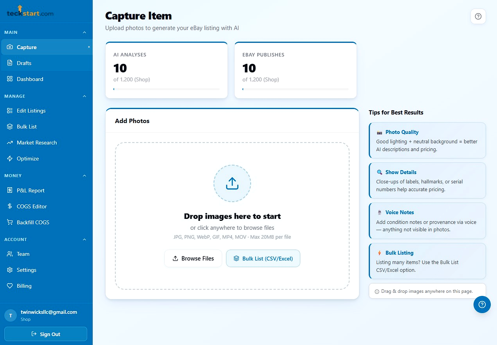
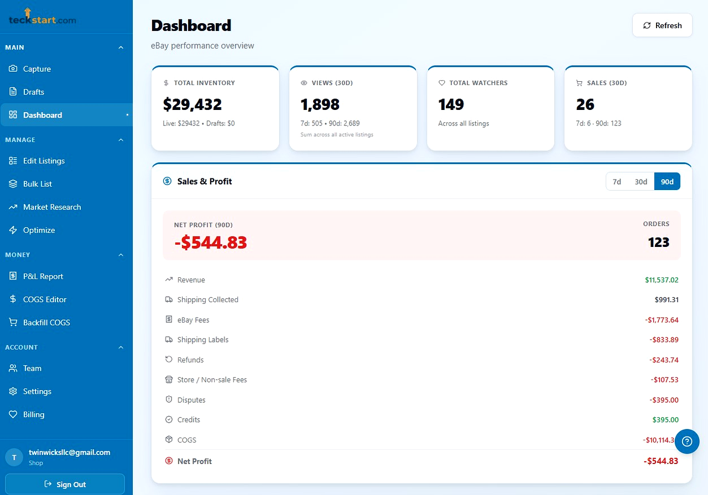
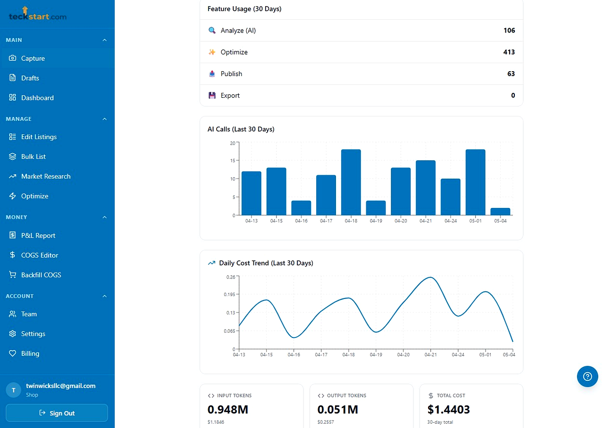
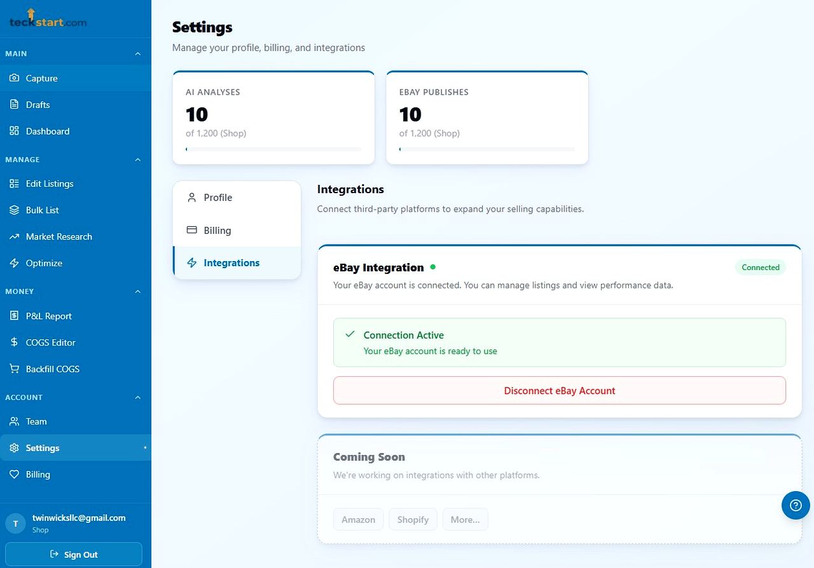
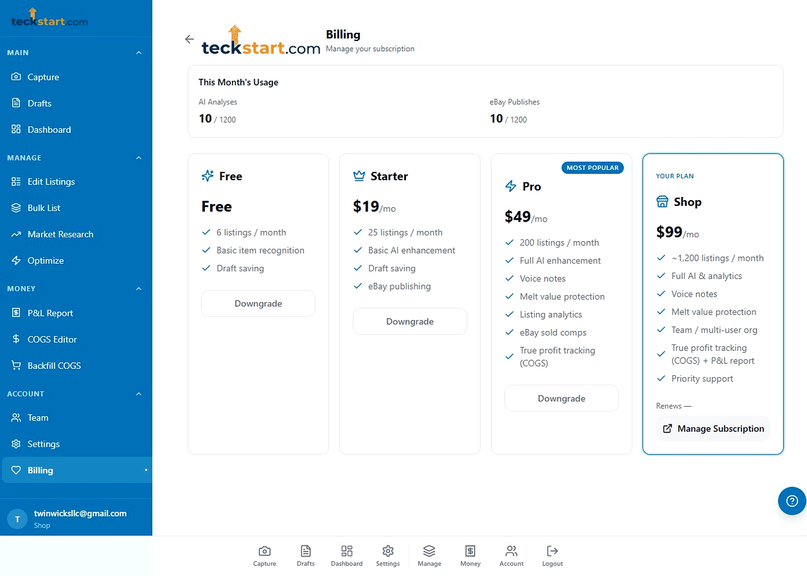

<div align="center">

# 🪙 Listing Assistant Pro

**An AI-powered eBay listing platform built for serious coin, bullion & collectible sellers.**

[](https://listing-assistant-pro.vercel.app)
[](https://www.typescriptlang.org/)
[](https://react.dev/)
[](https://supabase.com/)

</div>

---

## 📸 Screenshots

<table>
  <tr>
    <td align="center" width="50%">
      
      <br/><sub><b>AI Listing Generation</b> — Upload photos, Gemini Vision analyzes and generates title, description, category & item specifics</sub>
    </td>
    <td align="center" width="50%">
      
      <br/><sub><b>Dashboard & P&L</b> — Real-time inventory value, 30/90-day sales, true net profit with full fee breakdown</sub>
    </td>
  </tr>
  <tr>
    <td align="center" width="50%">
      
      <br/><sub><b>AI Usage Analytics</b> — Feature usage, daily AI call bar chart, cost trend line, token consumption & cost tracking</sub>
    </td>
    <td align="center" width="50%">
      
      <br/><sub><b>eBay Integration</b> — OAuth-connected eBay account management with live connection status</sub>
    </td>
  </tr>
  <tr>
    <td align="center" colspan="2">
      
      <br/><sub><b>Subscription Plans</b> — Free · Starter · Pro · Shop tiers with Stripe billing management</sub>
    </td>
  </tr>
</table>

---

## 📖 What Is It?

Listing Assistant Pro is a full-stack Progressive Web App that dramatically accelerates the process of creating high-quality eBay listings for coins, bullion, and collectibles. Sellers upload photos, and the app uses **Google Gemini AI** to instantly generate optimized titles, descriptions, eBay category IDs, and item specifics — all without manual data entry.

The platform goes far beyond listing creation: it includes a real-time analytics dashboard, competitor price monitoring, market research tools, profit tracking with COGS, automatic repricing rules, and direct eBay publishing — all packaged in a mobile-first PWA you can install on any device.

---

## ✨ Feature Highlights

### 🤖 AI-Powered Listing Generation
- Upload one or more photos of an item from any angle — or **record a short video**; the app automatically extracts the sharpest, most representative frames for AI analysis
- Gemini AI analyzes the images and generates a full listing: **title, description, eBay category, and item specifics**
- **Voice notes** can be recorded and transcribed to give the AI additional context (coin grade, condition notes, provenance, etc.)
- **Self-learning eBay category matching**: a weekly sync pulls eBay's complete, current category taxonomy so category suggestions stay accurate as eBay renames/retires categories, backed by an automated hygiene job that decays and expires low-confidence matches over time

### 💰 Smart Pricing Engine
- Fetches recent **sold eBay listings** to suggest an accurate price range
- **Melt Value Protection**: for precious metals (gold, silver, platinum), automatically enforces a price floor above the intrinsic melt value using **live spot prices** (refreshed every 15 minutes across all users via a shared Supabase cache)

### 📦 Direct eBay Publishing
- Publishes listings directly to eBay via the **eBay Inventory & Trading APIs**
- Handles eBay **Business Policy** selection (fulfillment, payment, returns) with a 24-hour cache for performance
- Full **eBay Taxonomy integration**: auto-discovers the correct category, fetches required item specifics, and validates all aspect values against eBay's allowed lists before publish
- Accurately forwards **shipping weight and package dimensions** to eBay — weight and dimensions are handled independently, so partial input (e.g. an envelope with only height & width) still reaches the listing instead of being dropped
- Supports both **Fixed Price** and **Auction** listing formats
- **Bulk publish** from a CSV upload with tier-based row caps (Starter 5 / Pro 50 / Shop 1,000 rows per batch)

### 📊 Analytics Dashboard
- Multi-window analytics: **7-day / 30-day / 90-day** views side by side
- Per-listing metrics: views, impressions, click-through rate, watchers, transactions
- Trend indicators: **🔥 Hot / Stable / 📉 Stale** based on engagement velocity
- Sort & filter by views, watchers, impressions, engagement level

### 🔍 Competitor Price Monitoring
- Surfaces the **top 3 competing listings** for each item you have listed
- Competitor price cards on the dashboard with snapshot history stored in Supabase
- Identifies listings priced significantly above or below the market median

### 📈 Market Research Tools
- Save **Market Watches** on any search term or category to track pricing trends over time
- **Sell-through rate** calculation: sold ÷ (sold + active) gives a real-time supply/demand signal
- 30/60/90-day **price history charts** (Recharts)
- Category heat map: visual of which portfolio categories are performing hot vs. cold

### 🏷️ True Profit / COGS Tracking
- Record **Cost of Goods Sold** (acquisition cost, source, purchase date) on any listing
- Dashboard shows **true net profit** = revenue − eBay fees − shipping labels − COGS
- Per-item profit margin %, color-coded low-margin alerts, and **P&L report** with CSV export

### 🔁 Auto-Optimization
- **Listing Health Score** (0–100): scores each active listing on views, CTR, watchers, and sales; flags stale/underperforming listings with actionable suggestions
- **Smart Relist**: one-click relist of stale or ended listings with optional price adjustment
- **Repricing Rules**: set rules like "always stay 5% below market median" and run them automatically
- **Title Optimizer**: AI rewrites listing titles using high-performing keywords from competitor research
- **Duplicate Listing Detector**: client-side Jaccard similarity analysis to surface near-duplicate listings

### 📉 Cost & Quality Monitoring
- **AI cost alerts**: scheduled job flags unusual spikes in AI token/API spend before they become a billing surprise
- **Domain quality reports**: tracks how accurately the AI is classifying item domains (coins/bullion vs. general merchandise) over time
- **Scheduled competitor price refresh**: keeps competitor snapshots current in the background instead of only on-demand

### 👥 Teams & Organizations
- Multi-user organization support with per-org usage quotas
- Role-based access (owner vs. member)
- Team management page with invite/remove functionality

### 📱 Progressive Web App
- Fully installable on iOS, Android, and desktop
- Offline capability via Workbox service worker
- Mobile-first responsive UI

---

## 🏗️ Architecture

```
┌──────────────────────┐     ┌──────────────────┐     ┌──────────────────┐
│   React 18 PWA  │────▶│  Supabase Auth   │────▶│  Google OAuth /  │
│   (Frontend)    │     │                  │     │  Email Auth      │
└────────┬─────┘     └────────────────┘     └──────────────────┘
         │
         ├────────────────���───┬─────────────────┬──────────────────┐
         │                  │                   │                  │
         ▼                  ▼                   ▼                  ▼
┌──────────────┐  ┌──────────────────┐  ┌──────────┐  ┌──────────────┐
│  Supabase    │  │  Supabase Edge   │  │  eBay APIs │  │  Stripe API  │
│  PostgreSQL  │  │  Functions (Deno)│  │  (Inventory│  │  (Billing)   │
│  (Database)  │  │                  │  │  Trading,  │  │              │
└──────────────┘  └────────┬───────┘  │  Finding)  │  └──────────────┘
                           │            └──────────┘
                  ┌────────┬──────────┐
                  │  Google Gemini AI │
                  │  (Vision + Text)  │
                  └──────────────────┘
```

### Supabase Edge Functions

| Function | Purpose |
|---|---|
| `analyze-item` | Sends images/video frames to Gemini, returns title/description/category/aspects |
| `video-frame-extract` | Extracts the sharpest, most representative frames from an uploaded item video |
| `ebay-publish` | Creates or publishes a listing to eBay via Inventory API |
| `bulk-publish` | Publishes a batch of CSV-sourced listings, gated by plan-tier row caps |
| `ebay-listings` | Fetches active eBay listings with multi-window analytics |
| `ebay-pricing` | Fetches recent sold comps for price suggestions |
| `ebay-competitor-search` | Searches eBay for competitor listings on a given item |
| `competitor-prices-cron` | Scheduled background refresh of competitor price snapshots |
| `filter-comparable-listings` | Filters competitor search results down to genuinely comparable items |
| `keyword-research` | eBay Browse API search stats (price distribution, sold counts) for market research |
| `market-watch-refresh` | Refreshes saved Market Watches with live eBay pricing data |
| `optimize-listing` | Analyzes a live listing's market data to suggest title/price improvements |
| `ebay-reprice` | Executes single or bulk price updates against eBay (Inventory + legacy Trading API) |
| `auto-reprice-cron` | Scheduled job that applies each user's configured repricing rules |
| `auto-reprice-trigger` | On-demand trigger for evaluating repricing rules outside the schedule |
| `spot-prices` | Fetches & caches live metal spot prices (shared cache across users) |
| `category-lookup` | 4-tier eBay category resolution: DB match, eBay suggestions, Gemini fallback, plus aspect-rule caching |
| `sync-ebay-taxonomy` | Weekly job that pulls eBay's entire active category tree into the taxonomy cache |
| `category-hygiene-cron` | Weekly cleanup: dedupes/decays/expires low-confidence category mappings and stale cache rows |
| `setup-categories` | One-time DB bootstrap/seed for category reference tables |
| `domain-quality-report` | Reports on AI item-domain classification accuracy over time |
| `cost-alert-cron` | Flags unusual spikes in AI/API cost before they hit billing |
| `cogs-report` | Pulls eBay Finances API shipping label costs to compute accurate P&L |
| `ebay-policies` | Fetches and caches the seller's eBay business policies (fulfillment/payment/return) |
| `ebay-user` | Fetches the connected eBay account's profile info |
| `disconnect-ebay` | Revokes/clears a user's eBay OAuth connection |
| `transcribe-voice` | Transcribes voice note audio for AI context |
| `create-checkout` | Creates Stripe checkout sessions for plan upgrades (monthly or annual) |
| `customer-portal` | Opens the Stripe billing self-service portal |
| `stripe-webhook` | Handles Stripe subscription lifecycle events |
| `check-subscription` | Returns current subscription tier (DB-cached) |
| `get-free-credits` | Grants free/trial/referral usage credits |
| `bulk-generate-descriptions` | Batch AI description generation for bulk listing flows |
| `system-status` | Health/status check endpoint for internal monitoring |

### Database Tables (Supabase PostgreSQL + PL/pgSQL)

| Table | Purpose |
|---|---|
| `profiles` | User profiles, eBay OAuth tokens, Stripe customer ID |
| `drafts` | Saved and published listing drafts with COGS fields |
| `subscriptions` | Stripe subscription state per user |
| `organizations` | Team/org definitions with free-tier reset config |
| `organization_members` | User-to-org membership |
| `usage_tracking` | Per-org rolling-window credit usage |
| `spot_price_cache` | Shared 15-min cache for metal spot prices |
| `competitor_prices` | Competitor price snapshots per listing |
| `listing_cogs` | COGS data keyed by eBay SKU for P&L calculations |
| `market_watches` | Saved market research watches |
| `market_price_history` | Time-series price data per market watch |
| `reprice_rules` | Auto-repricing rule definitions |
| `relist_history` | Audit log for relist actions |
| `category_mappings` | Learned item-type → eBay category mappings with confidence scoring |
| `category_aspects_cache` | Cached eBay required/recommended item specifics per category (7-day TTL) |
| `ebay_taxonomy_cache` | Full eBay category tree with breadcrumbs, refreshed weekly |
| `category_hygiene_log` | Execution history for the weekly category hygiene job |

---

## 🛠️ Tech Stack

| Layer | Technology |
|---|---|
| **Frontend** | React 18, TypeScript, Vite |
| **Styling** | Tailwind CSS, shadcn/ui (Radix UI primitives) |
| **Routing** | React Router v6 |
| **Forms** | React Hook Form + Zod |
| **Charts** | Recharts |
| **State / Data Fetching** | TanStack Query v5 |
| **Auth** | Supabase Auth (Google OAuth + Email/Password) |
| **Database** | Supabase PostgreSQL + PL/pgSQL Edge Functions (Deno) |
| **AI** | Google Gemini (Vision + text generation) |
| **eBay Integration** | eBay Inventory API, Trading API, Finding API, Taxonomy API |
| **Payments** | Stripe (Checkout, Customer Portal, Webhooks) |
| **PWA** | vite-plugin-pwa + Workbox |
| **Error Monitoring** | Sentry |
| **Deployment** | Vercel |
| **Package Manager** | Bun |
| **Testing** | Vitest + Testing Library |

---

## 💳 Pricing Tiers

| Tier | Monthly | Annual | Listings / Month | Highlights |
|---|---|---|---|---|
| **Free** | $0 | — | 6 | Basic AI recognition, draft saving |
| **Starter** | $19/mo | $190/yr | 25 | eBay publishing, basic AI enhancement |
| **Pro** | $49/mo | $490/yr | 200 | Voice notes, melt protection, analytics, sold comps, market research |
| **Shop** | $99/mo | $990/yr | ~1,200 | All features + teams, auto-optimization, unlimited market watches |

Annual plans are billed once per year at a discount versus paying monthly, managed through Stripe Checkout.

---

## 🗂️ App Pages & Routes

| Page | Route | Description |
|---|---|---|
| Landing | `/landing` | Public marketing page shown to signed-out visitors |
| Home | `/home` | Post-login landing dashboard |
| Analyze | `/analyze` | Listing creation page (upload photos/video, AI analysis, publish) |
| Dashboard | `/dashboard` | Analytics overview, active listings table, competitor cards |
| Listings | `/listings` | Dedicated eBay listings management view |
| Drafts | `/drafts` | Saved draft listings |
| Market Research | `/market` | Keyword research, saved watches, price trend charts |
| Reprice Rules | `/reprice-rules` | Auto-repricing rule management |
| Profit Report | `/profit-report` | P&L report with COGS integration + CSV export |
| Bulk Listing | `/bulk` | CSV-based bulk listing upload |
| Bulk COGS Editor | `/cogs-editor` | Batch COGS entry for existing listings |
| Historical COGS | `/historical-cogs` | Backfill/review COGS for previously published listings |
| Settings | `/settings` | Profile, eBay connection, integrations |
| Billing | `/billing` | Subscription management via Stripe portal (monthly/annual) |
| Team | `/team` | Organization member management |
| Admin | `/admin` | Admin panel (internal) |
| Terms / Privacy | `/terms`, `/privacy` | In-app legal & policy pages |

---

## 🚀 Getting Started (Local Development)

### Prerequisites
- Node.js 18+ (or Bun)
- A [Supabase](https://supabase.com) project with Google OAuth configured
- A [Google AI Studio](https://aistudio.google.com) API key (Gemini)
- An eBay Developer account with a registered app

### Installation

```bash
git clone https://github.com/twinwicksllc/listing-assistant-pro.git
cd listing-assistant-pro
bun install   # or: npm install
```

### Environment Variables

Create a `.env.local` file:

```env
VITE_SUPABASE_URL=your_supabase_project_url
VITE_SUPABASE_PUBLISHABLE_KEY=your_supabase_anon_key
```

### Run the Dev Server

```bash
bun run dev   # or: npm run dev
```

App available at `http://localhost:8080`

### Run Tests

```bash
bun run test  # or: npm test
```

---

## 📦 Deployment

The app is deployed on **Vercel** with automatic builds on push to `main`.

1. Connect the GitHub repository to Vercel
2. Add `VITE_SUPABASE_URL` and `VITE_SUPABASE_PUBLISHABLE_KEY` as environment variables
3. Push to `main` — Vercel builds and deploys automatically

Supabase Edge Functions are deployed separately via the [Supabase CLI](https://supabase.com/docs/guides/cli).

---

## 📄 License

Proprietary software — © Twinwicks LLC. All rights reserved.
